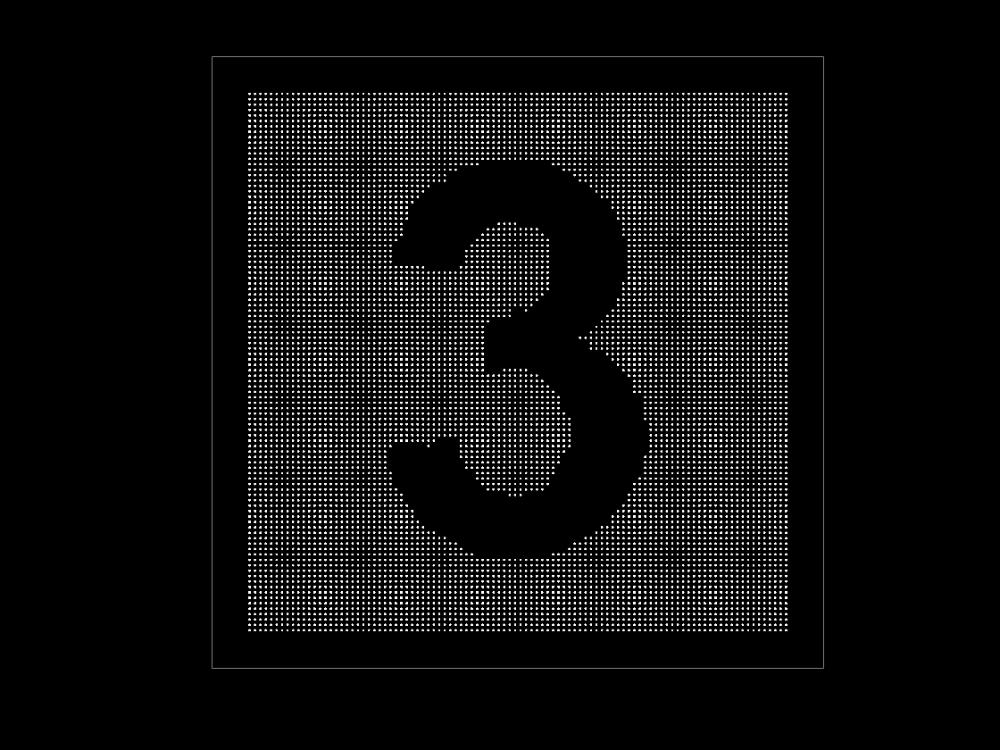
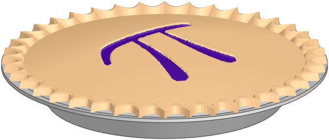
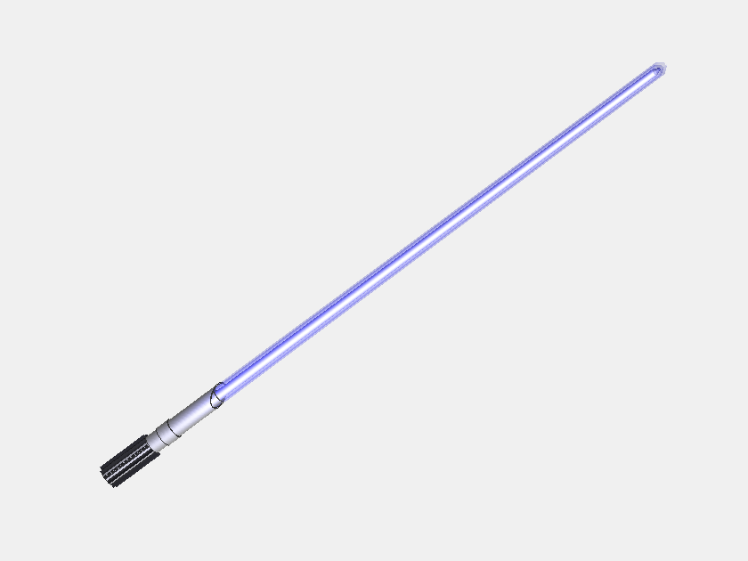
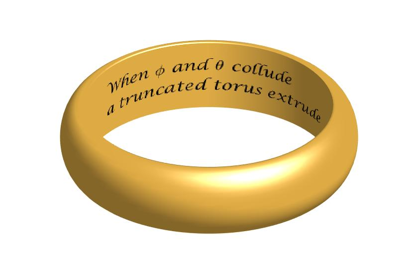

# Digital Art with MATLAB

This is a repository to share interesting bits of art created with MATLAB.

See the README in each directory for how to use each of the examples.

## Parallax

- parallax - Draw two images hidden behind eachother in 3d

See dfltimg_parallax.m

See countdown.mlx : 

## In other's folder

- cookie - Draw shaped cookies
- flowers - Draw some flowers
- may4th - Draw may 4th themed images
- pipie - Draw a pie with a pi on it
- pumpkin - Draw a pumpkin
- ring - Draw a gold ring with inscription
- snake - Draw an animated snake folding toy
- snowflake - Draw snowflakes

Sample images:

